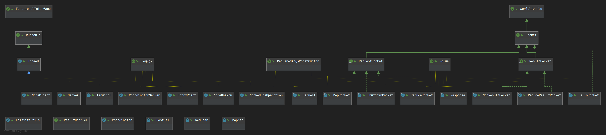

# Map-Reduce

Compteur de mots à la map-reduce

Il s’agit ici de reproduire le comportement d’Hadoop sur l’exemple de
comptage de mots vu en cours. Vous ne devez pas utiliser la plateforme
Hadoop, mais concevoir une plateforme distribuée de comptage de mots
basée sur map-reduce (à programmer avec des Sockets ou du RMI par
exemple).

En entrée : un ensemble de fichiers texte contenant des mots ; en sortie :
un dictionnaire comportant l’ensemble des mots associés au compteur
de leur nombre d’occurrences. Dans une première phase, une tache par
fichier va compter les nombres d’occurrences des mots du fichier qu’elle
a reçue (MAP), dans un deuxième temps un nombre fixé de taches
« reduce » vont récupérer chez chacunes des taches map le sous
ensemble des mots dont elle est « responsable » et comptabiliser pour
chacun des ces mots, le nombre total d’occurrences.

Le niveau de difficulté peut se « régler » :

  - En fixant ou non de nombreux paramètres comme : le nombre de taches maps, la répartition des mots sur les taches reduces
  - En prenant en compte ou non les fautes de taches map et réduce… (monitoring + relance / exécution spéclative…)
  - Selon le niveau d’implémentation (socket/rmi/mono-processus multithreadé…)

Aide : utilisez un nœud coordinateur pour lancer les taches map et
reduce.

Pour tester votre plateforme vous pouvez prendre des pages web
quelconques. Testez votre plateforme en variant le nombre de machines
travaillant en parallèle et observez (mesurez) les effets.

## Diagramms

Class diagram : 

